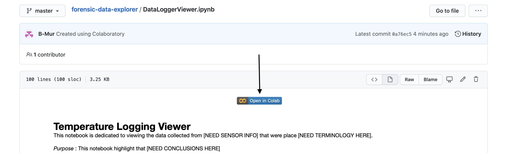
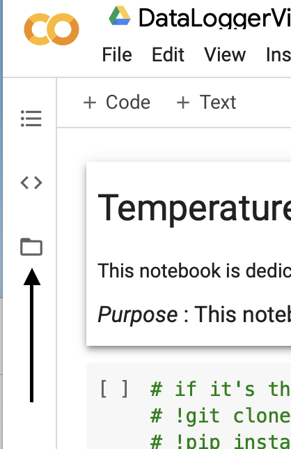

# GoogleColabSetup.md
In order to run the GoogleColab notebooks, please follow this set of instructions : 

- Click the following shared Google Drive link ()
- Right click the folder and click the button "Add to my Drive"
- Navigate to the ColabNotebooks folder
- Select any notebook
- Click the blue "Open in Colab" button

- On the left side of the browser, click the folder icon. 

- Connect GoogleDrive to colab
- Follow instructions for connecting
- Now, follow the notebook starting from the top. 

